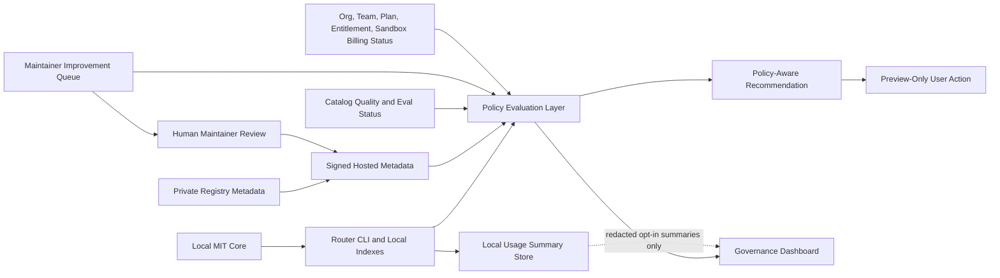

# RFC: v0.4 SkillOps Platform

Status: draft for development readiness review.

## Value-Focused Product

`v0.4` turns the `v0.3.x` alpha feature set into a governed SkillOps platform:

> Governed skill delivery -> measurable skill quality -> maintainer-controlled improvements -> policy-aware recommendations -> future self-improving SkillOps, with every automated proposal still human-reviewed.

The immediate value is not autonomous skill mutation. The value is that maintainers, teams, and enterprise operators can see what skill content is eligible, what quality signals exist, what improvements are pending, what policy allows, and what action is recommended without leaking prompts, skill bodies, private repo data, local paths, tokens, or secrets.

## What v0.4 Is Not

- Not a runtime implementation plan by itself.
- Not a final release declaration.
- Not live billing, checkout, card collection, bank data handling, invoices, refunds, or real charges.
- Not a PyPI publication plan; no PyPI publication is authorized.
- Not full catalog distribution.
- Not automatic telemetry.
- Not automatic skill rewriting.
- Not automatic hosted query forwarding by default.
- Not automatic publication of improved skills; no auto-publish is authorized.
- Not a requirement that local MIT core users register.
- Not authorization to move private registry/backend code or private skill bodies into the public repo.

## Candidate Modules

### 1. Policy-Aware Skill Recommendation

Recommends actions by combining catalog metadata, local install state, signed quality status, improvement status, private-pack access, team/org policy, plan entitlement, and sandbox billing diagnostics.

Required properties:

- metadata-only inputs by default;
- no prompt upload;
- no skill body upload;
- no automatic hosted query forwarding;
- no automatic install, update, remove, rewrite, or publish;
- signed hosted manifest envelopes for any hosted recommendation payload;
- explicit local-only fallback for MIT core.

### 2. Eval-Driven Catalog Release Gates

Turns `catalog quality` and `eval-status` into a release gate that can block or warn on candidate catalog releases.

Required properties:

- signed eval status evidence;
- score bands and minimum coverage rules;
- release-owner override format;
- fixed-pending-eval rules for improvement closure;
- support-safe summaries;
- no execution of untrusted skill scripts in public client gates.

### 3. Maintainer Improvement Queues

Extends the `v0.3.9` maintainer-controlled improvement workflow into a queue with explicit owner, status, severity, evidence, and review state.

Required queue states:

- `reported`
- `triaged`
- `accepted`
- `fix_in_progress`
- `fixed_pending_eval`
- `verified`
- `rejected`
- `deferred`
- `retired`

Automatic proposal generation may be researched later, but queue transitions that affect catalog status require human maintainer approval.

### 4. Agent/Runtime Usage Summaries

Provides local and redacted summaries of how skills are searched, viewed, used, accepted, or rejected.

Required properties:

- local-first source of truth;
- opt-in export only;
- no prompts, task text, search query uploads, skill bodies, local paths, repo paths, customer names, tokens, or secrets;
- bucketed/count-based support bundle summaries by default.

### 5. Governance Dashboard

Provides operators and maintainers with a redacted view of policy, entitlements, private packs, queue health, eval gate state, and support diagnostics.

Required properties:

- role-gated access;
- signed hosted metadata;
- support-safe redaction;
- no private skill bodies by default;
- no admin actions from unauthenticated local clients.

### 6. Optional Self-Hosted Registry Mode

Allows organizations to run registry, policy, and catalog metadata surfaces in their own environment.

Required properties:

- explicit configuration;
- pinned registry origin and trusted keys;
- signed manifests;
- no fallback to a hosted registry unless configured;
- documented backup, signing, and incident procedures.

### 7. Future Automatic Improvement Proposals

Research track only. The system may draft improvement proposals from evals, feedback, and local usage summaries after explicit user/admin opt-in.

Hard boundary:

- generated proposals are drafts;
- human maintainers review and approve;
- no automatic rewriting;
- no automatic publication;
- no automatic skill installation.

## Architecture

## Data Boundaries

| Boundary | May cross | Must not cross by default |
| --- | --- | --- |
| Local MIT core to hosted metadata | install id, public device key, client version, collection version metadata, source labels, coarse count buckets, explicit catalog filters when user requests hosted search | prompts, task text, skill bodies, source code, full paths, repo paths, filenames from private projects, customer names, env values, tokens, secrets, device private keys |
| Local usage summaries to support | counts, status buckets, component versions, redacted diagnostics | raw prompts, search queries, skill bodies, private pack names by default, private skill names, archive URLs, tokens, proofs, private keys |
| Private registry to public client | signed metadata, entitlement status, policy assignments, quality/eval status, improvement status, preview-only recommendations | backend code, private signing keys, private skill bodies in the public repo, private inventory in public docs |
| Governance dashboard to users | role-allowed summaries, queue status, release gate status, policy denials | data outside the user's org/team scope, raw secrets, private key material, unredacted local paths |

## Trust Boundaries

- Local file system: trusted only by the local user; must preserve `local` skill data and must not delete unrelated local content.
- Public MIT repo: trusted for open-source client code, docs, schemas, sanitized examples, and bundled public packs only.
- Hosted registry: trusted only through configured origin, registration state, device proof, and signed manifests.
- Private registry/backend: trusted operational surface outside the public repo; contracts must be explicit before public client implementation.
- Self-hosted registry: trusted only after operator pins origin and keys.
- Agent runtime: not trusted to mutate skills without explicit user/maintainer action.

## Permission Model

| Actor | Allowed in v0.4 planning | Not allowed |
| --- | --- | --- |
| Local MIT user | Search, view, use, feedback logs, local indexing, local daemon, public self-update, local diagnostics | Forced registration, automatic hosted query forwarding, live billing |
| Registered user | Hosted signed metadata checks, catalog browser, feedback, quality/eval status, preview recommendations | Automatic install/update/remove/rewrite/publish |
| Team admin | Team sync, member governance, assigned private/team pack diagnostics, policy-aware recommendations for team scope | Viewing unrelated private skill bodies or org data |
| Enterprise admin | Managed policy sync, governance dashboard summaries, release gate review, self-hosted registry configuration | Weakening signed manifest requirements or bypassing local MIT access |
| Maintainer | Queue triage, fix acceptance, fixed-pending-eval, signed metadata publication after review | Autonomous publishing without review |
| Release owner | Override release gates with documented reason and fallback | Silent override or unrecorded release train cleanup |

## Migration Plan

1. **Spec lock:** land this RFC and the readiness audit as docs-only.
2. **Contract fixtures:** add fixture schemas and fake-service responses for recommendation, queue, gate, dashboard, and self-hosted registry mode.
3. **Read-only clients:** implement local read-only preview commands that consume signed fixture metadata and refuse unsigned, sensitive, or write-capable payloads.
4. **Governance gates:** add eval/recommendation release gates with documented release-owner override.
5. **Dashboard MVP:** add redacted dashboard summaries after role/permission contracts are accepted.
6. **Self-hosted mode:** add explicit origin/key pinning and no-hosted-fallback behavior.
7. **Proposal research:** only after the above, design human-reviewed automatic improvement proposal drafts.

## Release Gate

v0.4 implementation epics must begin with:

- fixture-mode tests;
- signed manifest verification;
- no production hosted calls in public tests;
- no runtime publication side effects;
- support-safe redaction tests;
- PR hygiene evidence for the stacked release train.

## Open Questions

- Which private registry PR owns the first SkillOps metadata contract?
- Which score thresholds are acceptable for eval-driven gates during alpha?
- Which roles exist in the hosted governance dashboard MVP?
- What minimum evidence must a release-owner override include?
- Which self-hosted registry deployment shape is supported first: single-node, VPC, or air-gapped export/import?
