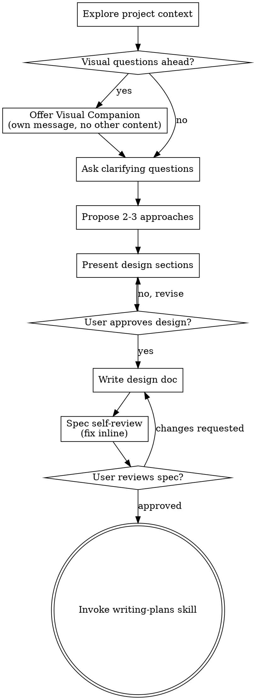

## When to Use

Use before creative or implementation work such as creating features, building components, adding functionality, modifying behavior, or shaping a product/design idea. Use when the request is not yet specified enough to implement safely and the agent needs to understand purpose, constraints, success criteria, architecture, components, data flow, error handling, and testing before writing code.

## When Not to Use

Do not use after the user has already approved a concrete design and is asking for implementation planning or coding. Do not use for pure bug fixes, narrow mechanical edits, or tasks where the required change is already explicit and no design choices remain. Do not use to delay urgent troubleshooting or verification work.

## Required Context

Inspect the current project state first: relevant files, docs, recent commits, existing architecture, and user-provided requirements. Determine whether the request is one focused project or multiple independent subsystems that must be decomposed. If visual choices are likely, ask whether the user wants a visual companion before asking detailed design questions.

## Procedure

1. Explore the current project context before asking detailed questions.
2. If the request spans multiple independent subsystems, stop and help decompose it into smaller sub-projects before designing the first one.
3. If upcoming questions would be clearer visually, offer the visual companion in a standalone message and wait for the user's answer.
4. Ask one clarifying question at a time, preferring multiple-choice questions when practical.
5. Clarify purpose, constraints, success criteria, architecture, components, data flow, error handling, testing, and user-visible behavior.
6. Propose two or three viable approaches with trade-offs, lead with the recommended option, and explain why.
7. Present the design in sections sized to the task complexity and ask for confirmation after each section.
8. Revise the design until the user approves it; do not write implementation code before approval.
9. Write the approved design to docs/superpowers/specs/YYYY-MM-DD-<topic>-design.md unless project or user preferences specify another location.
10. Self-review the spec for placeholders, contradictions, excessive scope, and ambiguous requirements; fix issues inline.
11. Ask the user to review the written spec before moving to implementation planning.
12. After approval, transition to the writing-plans skill; do not invoke implementation skills directly from brainstorming.

## Tools

1. File inspection tools for reading project files, docs, and recent changes
2. Git history/status tools when available
3. Browser or visual companion only when visual comparison would materially improve the discussion
4. Document editing tools for writing the approved design spec

## Expected Output

An approved design specification committed or saved at the agreed path, plus a clear handoff to implementation planning. The output should include the chosen approach, scoped requirements, architecture/components, data flow, error handling, testing strategy, and any explicit exclusions or deferred work.

## Known Traps

1. Starting implementation before the user approves the design.
2. Treating a small request as too simple for design and skipping assumptions that later cause rework.
3. Asking multiple clarifying questions in one message and overwhelming the user.
4. Using the visual companion for conceptual/textual questions where text is clearer.
5. Failing to decompose a large multi-subsystem request before trying to design everything at once.
6. Writing a spec that contains TBDs, contradictions, vague requirements, or an implementation scope too large for a single plan.
7. Invoking an implementation skill instead of writing-plans after the design is approved.

## Examples of Successful Execution

1. For a new feature request, the agent inspects the project, asks one clarifying question at a time, proposes multiple approaches, gets approval on the design, writes docs/superpowers/specs/YYYY-MM-DD-<topic>-design.md, self-reviews it, and asks the user to review before planning implementation.
2. For a broad platform request with chat, storage, billing, and analytics, the agent first decomposes the work into independent sub-projects and only brainstorms the first focused sub-project through the full design flow.

## Regression Tests

1. The transcript shows project context was inspected before detailed design questions.
2. No implementation code, scaffolding, or implementation skill invocation occurred before user approval of the design.
3. Clarifying questions were asked one at a time.
4. The final design includes architecture/components, data flow, error handling, and testing or explicitly states why a section is not applicable.
5. The written spec contains no TBD/TODO placeholders, internal contradictions, or ambiguous requirements.
6. The handoff after approved design is to writing-plans, not directly to coding.

## Original Skill Body

## Brainstorming Ideas Into Designs

Help turn ideas into fully formed designs and specs through natural collaborative dialogue.

Start by understanding the current project context, then ask questions one at a time to refine the idea. Once you understand what you're building, present the design and get user approval.

<HARD-GATE>
Do NOT invoke any implementation skill, write any code, scaffold any project, or take any implementation action until you have presented a design and the user has approved it. This applies to EVERY project regardless of perceived simplicity.
</HARD-GATE>

## Anti-Pattern: "This Is Too Simple To Need A Design"

Every project goes through this process. A todo list, a single-function utility, a config change — all of them. "Simple" projects are where unexamined assumptions cause the most wasted work. The design can be short (a few sentences for truly simple projects), but you MUST present it and get approval.

## Process Flow

**The terminal state is invoking writing-plans.** Do NOT invoke frontend-design, mcp-builder, or any other implementation skill. The ONLY skill you invoke after brainstorming is writing-plans.

## The Process

**Understanding the idea:**

- Check out the current project state first (files, docs, recent commits)
- Before asking detailed questions, assess scope: if the request describes multiple independent subsystems (e.g., "build a platform with chat, file storage, billing, and analytics"), flag this immediately. Don't spend questions refining details of a project that needs to be decomposed first.
- If the project is too large for a single spec, help the user decompose into sub-projects: what are the independent pieces, how do they relate, what order should they be built? Then brainstorm the first sub-project through the normal design flow. Each sub-project gets its own spec → plan → implementation cycle.
- For appropriately-scoped projects, ask questions one at a time to refine the idea
- Prefer multiple choice questions when possible, but open-ended is fine too
- Only one question per message - if a topic needs more exploration, break it into multiple questions
- Focus on understanding: purpose, constraints, success criteria

**Exploring approaches:**

- Propose 2-3 different approaches with trade-offs
- Present options conversationally with your recommendation and reasoning
- Lead with your recommended option and explain why

**Presenting the design:**

- Once you believe you understand what you're building, present the design
- Scale each section to its complexity: a few sentences if straightforward, up to 200-300 words if nuanced
- Ask after each section whether it looks right so far
- Cover: architecture, components, data flow, error handling, testing
- Be ready to go back and clarify if something doesn't make sense

**Design for isolation and clarity:**

- Break the system into smaller units that each have one clear purpose, communicate through well-defined interfaces, and can be understood and tested independently
- For each unit, you should be able to answer: what does it do, how do you use it, and what does it depend on?
- Can someone understand what a unit does without reading its internals? Can you change the internals without breaking consumers? If not, the boundaries need work.
- Smaller, well-bounded units are also easier for you to work with - you reason better about code you can hold in context at once, and your edits are more reliable when files are focused. When a file grows large, that's often a signal that it's doing too much.

**Working in existing codebases:**

- Explore the current structure before proposing changes. Follow existing patterns.
- Where existing code has problems that affect the work (e.g., a file that's grown too large, unclear boundaries, tangled responsibilities), include targeted improvements as part of the design - the way a good developer improves code they're working in.
- Don't propose unrelated refactoring. Stay focused on what serves the current goal.

## After the Design

**Documentation:**

- Write the validated design (spec) to `docs/superpowers/specs/YYYY-MM-DD-<topic>-design.md`
  - (User preferences for spec location override this default)
- Use elements-of-style:writing-clearly-and-concisely skill if available
- Commit the design document to git

**Spec Self-Review:**
After writing the spec document, look at it with fresh eyes:

1. **Placeholder scan:** Any "TBD", "TODO", incomplete sections, or vague requirements? Fix them.
2. **Internal consistency:** Do any sections contradict each other? Does the architecture match the feature descriptions?
3. **Scope check:** Is this focused enough for a single implementation plan, or does it need decomposition?
4. **Ambiguity check:** Could any requirement be interpreted two different ways? If so, pick one and make it explicit.

Fix any issues inline. No need to re-review — just fix and move on.

**User Review Gate:**
After the spec review loop passes, ask the user to review the written spec before proceeding:

> "Spec written and committed to `<path>`. Please review it and let me know if you want to make any changes before we start writing out the implementation plan."

Wait for the user's response. If they request changes, make them and re-run the spec review loop. Only proceed once the user approves.

**Implementation:**

- Invoke the writing-plans skill to create a detailed implementation plan
- Do NOT invoke any other skill. writing-plans is the next step.

## Key Principles

- **One question at a time** - Don't overwhelm with multiple questions
- **Multiple choice preferred** - Easier to answer than open-ended when possible
- **YAGNI ruthlessly** - Remove unnecessary features from all designs
- **Explore alternatives** - Always propose 2-3 approaches before settling
- **Incremental validation** - Present design, get approval before moving on
- **Be flexible** - Go back and clarify when something doesn't make sense

## Visual Companion

A browser-based companion for showing mockups, diagrams, and visual options during brainstorming. Available as a tool — not a mode. Accepting the companion means it's available for questions that benefit from visual treatment; it does NOT mean every question goes through the browser.

**Offering the companion:** When you anticipate that upcoming questions will involve visual content (mockups, layouts, diagrams), offer it once for consent:
> "Some of what we're working on might be easier to explain if I can show it to you in a web browser. I can put together mockups, diagrams, comparisons, and other visuals as we go. This feature is still new and can be token-intensive. Want to try it? (Requires opening a local URL)"

**This offer MUST be its own message.** Do not combine it with clarifying questions, context summaries, or any other content. The message should contain ONLY the offer above and nothing else. Wait for the user's response before continuing. If they decline, proceed with text-only brainstorming.

**Per-question decision:** Even after the user accepts, decide FOR EACH QUESTION whether to use the browser or the terminal. The test: **would the user understand this better by seeing it than reading it?**

- **Use the browser** for content that IS visual — mockups, wireframes, layout comparisons, architecture diagrams, side-by-side visual designs
- **Use the terminal** for content that is text — requirements questions, conceptual choices, tradeoff lists, A/B/C/D text options, scope decisions

A question about a UI topic is not automatically a visual question. "What does personality mean in this context?" is a conceptual question — use the terminal. "Which wizard layout works better?" is a visual question — use the browser.

If they agree to the companion, read the detailed guide before proceeding:
`skills/brainstorming/visual-companion.md`
